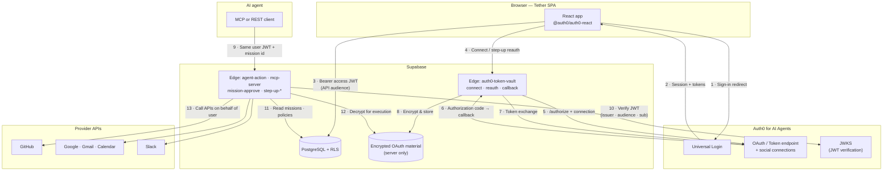

# Tether

**Mission-scoped authorization for AI agents** — human-approved, policy-enforced, time-bounded access to GitHub, Gmail, Google Calendar, and Slack. Built so **agents never receive OAuth credentials**; the platform executes API calls on behalf of the user after checking every action against the active mission, global policies, and (for high-risk operations) **step-up re-authentication**.

---

## Hackathon: Authorized to Act (Auth0 for AI Agents)

This project is designed for hackathons such as **[Authorized to Act](https://authorizedtoact.devpost.com/)**, where teams build **agentic applications** using **Auth0 for AI Agents** and the **[Token Vault](https://auth0.com/features/token-vault)** pattern.

**What judges should look for in Tether**

| Criterion | How Tether addresses it |
|-----------|-------------------------|
| **Security model** | Mission boundaries, server-side token handling, policy engine, execution-time checks, step-up for destructive/bulk actions (`github.delete_repo`, `gmail.download_all`). |
| **User control** | Manifests show *will do* / *will not do*, explicit approval (desktop or mobile PWA), visible scopes, audit ledger. |
| **Technical execution** | OAuth initiated through Auth0; callback and token exchange in `auth0-token-vault`; encrypted storage for execution secrets; Edge Functions for enforcement and MCP. |
| **Design** | Full React dashboard, mission lifecycle UX, mobile approval surface, analytics and ledger. |
| **Impact** | Reusable pattern: **runtime authorization for agents** via MCP + REST, not only “connect once” OAuth. |

**Demo checklist (submission)**

- Public app URL and a **~3 minute** video showing: connect account → create mission → approve → allowed tool call → **blocked** violation → (optional) step-up for a high-risk path.
- State clearly that **Auth0** handles user login and **OAuth to providers**, aligned with **Token Vault** usage in your deployment narrative.

---

## Table of contents

- [Problem](#problem)
- [Solution](#solution)
- [How it works](#how-it-works)
- [Features](#features)
- [Architecture](#architecture)
- [Auth0-centric architecture](#auth0-centric-architecture)
- [Auth0 and Token Vault](#auth0-and-token-vault)
- [Security model](#security-model)
- [Tech stack](#tech-stack)
- [Getting started](#getting-started)
- [Environment variables](#environment-variables)
- [Auth0 configuration](#auth0-configuration)
- [API reference](#api-reference)
- [Database schema](#database-schema)
- [Edge functions](#edge-functions)
- [Scripts](#scripts)
- [Production deployment](#production-deployment)
- [Project structure](#project-structure)
- [License](#license)

---

## Problem

Agents need API access to be useful, but **handing long-lived tokens to models, prompts, or tools** creates disproportionate risk: scope creep, no expiry, weak audit trails, and a single prompt injection away from account abuse.

| Approach | Outcome |
|----------|---------|
| **Broad OAuth to the agent** | High blast radius; credentials may leak into logs or prompts. |
| **No integrations** | Safe but impractical for real workflows. |

Tether targets a middle path: **delegated execution** with **explicit human consent**, **narrow grants**, **automatic expiry**, and **immutable logging**.

---

## Solution

Tether is an **authorization and execution gateway**. The user describes work in natural language; the system proposes a **mission manifest** (with a second-pass **intent audit**); the user **approves**; an **active mission** exposes a fixed set of actions until **expiry** or **completion**. Every call to `agent-action` (or MCP tools) is evaluated against:

1. Mission status and expiry  
2. Mission permissions (provider + scope + action registry)  
3. Global **policy rules** (e.g. block external email domains)  
4. **Step-up verification** for defined high-risk actions  

OAuth tokens used to call GitHub, Google, or Slack APIs are **not** passed to the agent; they are used only inside trusted Edge Functions.

---

## How it works

```
User describes task
    → AI generates mission manifest (+ optional scope negotiation)
    → Second AI audits intent (skeptical verifier)
    → Human approves (desktop or mobile; high-risk missions may require step-up re-auth)
    → Agent invokes tools / REST only within mission + policy
    → Access expires automatically; full history in execution ledger
```

**Core concepts**

| Concept | Description |
|---------|-------------|
| **Mission** | Time-bounded contract: objective, status (`pending` → `active` → completed/expired), risk level, manifest JSON. |
| **Manifest** | Structured summary: allowed actions, explicit denials, permissions, irreversible actions, intent verification. |
| **Policy engine** | User-defined rules applied at execution time; can block even when the mission would allow. |
| **Ambient mode** | Optional low-risk, budgeted auto-execution path (separate from strict mission mode). |

---

## Features

### Mission lifecycle

- Natural language mission creation  
- AI-generated manifests (configurable OpenAI-compatible API, e.g. Gemini)  
- Dual-AI intent verification  
- Human approval with realtime updates (Supabase Realtime)  
- Countdown to expiry; mission replay and post-mission summary  

### Enforcement and governance

- Central **agent-action** enforcement (scope, policy, validation)  
- **Mission approve** Edge Function so activation respects **step-up** server-side  
- **Step-up**: fresh provider OAuth (`prompt=consent`) for high-risk capabilities; short-lived verification record per mission  
- **MCP server** exposing tools derived from active missions (toggle in Settings)  
- **Execution ledger** with correlation IDs and block reasons  

### Integrations

- **GitHub** — issues, comments, repository operations (registry-defined)  
- **Gmail** — read/send/export patterns per action definitions  
- **Google Calendar** — list/create/update events  
- **Slack** — channels and messaging  

### Operator experience

- Dashboard analytics, notifications, PWA install path, dedicated **mobile approval** route (`/approve`)  

---

## Architecture

```
┌────────────────────────────────────────────────────────────────────┐
│                         Tether (application)                        │
├────────────────────────────────────────────────────────────────────┤
│  React + TypeScript (Vite)  •  PWA  •  Auth0 (SPA SDK)             │
│         │                    │                    │                 │
│         └────────────────────┴────────────────────┘                 │
│                              │                                      │
│                    Supabase Client (JWT + RLS)                      │
│                              │                                      │
│  ┌───────────────────────────▼──────────────────────────────────┐  │
│  │              Supabase Edge Functions (Deno)                   │  │
│  │  agent-action • mcp-server • mission-approve                  │  │
│  │  auth0-token-vault • step-up-* • generate-* • trust score     │  │
│  └───────────────────────────┬──────────────────────────────────┘  │
│                                │                                     │
│         ┌──────────────────────┴──────────────────────┐              │
│         ▼                                             ▼              │
│  Auth0 (login + OAuth to providers)          PostgreSQL + Realtime   │
│  Token exchange / consent flows               missions, logs, RLS    │
└────────────────────────────────────────────────────────────────────┘
```

### Auth0-centric architecture

The diagram below highlights **Auth0** for the **[Authorized to Act](https://authorizedtoact.devpost.com/)** narrative: **human identity**, **OAuth to providers** (Token Vault path), and **JWT verification** before any agent action runs. The agent sees only the user’s **Auth0-issued access token** for Tether APIs — never provider OAuth secrets.



**How this maps to judging language**

| Flow | Auth0 role |
|------|------------|
| 1–3 | **User control** — who is signed in; JWT `sub` ties data in Supabase to that human. |
| 4–8 | **Token Vault pattern** — OAuth to GitHub / Google / Slack goes through Auth0; secrets land encrypted in Tether’s backend, not in the agent. |
| 9–13 | **Security model** — every tool call is authenticated with the same Auth0 JWT, then **scoped** by mission + policy before provider APIs run. |

---

## Auth0 and Token Vault

- **End-user authentication** uses **Auth0 Universal Login**; the SPA obtains JWTs used with Supabase (see `VITE_AUTH0_*` in [Environment variables](#environment-variables)).

- **Connected accounts** (GitHub, Google properties, Slack) use the **`auth0-token-vault`** Edge Function: **authorize** → **callback** → **token exchange** with Auth0, then persistence of **encrypted** material for server-side API execution. Connect and reauth flows support an optional **`returnPath`** so users land back on the same screen after OAuth (e.g. mission detail or mobile approval).

- For hackathon narrative, position Tether as: **Auth0 orchestrates OAuth and consent**; **Tether never exposes tokens to the agent**; **execution is server-side and audited**. Align wording with your actual Auth0 **Token Vault** product usage in the tenant you demo.

---

## Security model

1. **Authentication** — Auth0 for users; JWT verified on Edge Functions where applicable.  
2. **Authorization** — PostgreSQL **RLS** isolates rows by authenticated subject.  
3. **Agent credentials** — Agents use **user JWT** + mission id; they do **not** receive provider OAuth tokens.  
4. **Mission gate** — Actions outside granted scopes or after expiry are **blocked** and logged.  
5. **Policy layer** — Additional denials (e.g. email domain rules).  
6. **Step-up** — Configured high-risk actions require recent provider re-authentication tied to the mission.  
7. **Auditability** — `execution_log` records allowed and blocked attempts with context.  

**Mitigations (summary)**

| Risk | Mitigation |
|------|------------|
| Token exfiltration to agent | Tokens used only in Edge Functions; encrypted at rest in app storage. |
| Scope creep | Manifest + dual-AI audit + human approval. |
| Standing access | Missions expire; ambient mode is budgeted and configurable. |
| Silent abuse | Ledger + realtime feeds + notifications. |

---

## Tech stack

| Layer | Technology |
|-------|------------|
| UI | React 18, TypeScript, Vite, Tailwind CSS, shadcn/ui, Framer Motion |
| Data & realtime | Supabase (PostgreSQL, Row Level Security, Realtime) |
| Compute | Supabase Edge Functions |
| AI | Google Gemini or any OpenAI-compatible API (`AI_COMPAT_API_URL` + `AI_COMPAT_API_KEY`) |
| Identity | Auth0 (`@auth0/auth0-react`) |
| Agent protocol | Model Context Protocol (MCP) over HTTP |
| PWA | vite-plugin-pwa |

---

## Getting started

### Prerequisites

- **Node.js** 18 or newer  
- **npm** (or compatible package manager)  
- **Supabase** project with Edge Functions enabled  
- **Auth0** tenant and application  
- **Auth0 social connections** for providers you intend to demo (GitHub, Google, Slack)  

### Install and run

```bash
git clone <YOUR_REPOSITORY_URL>
cd <project-directory>
npm install
npm run dev
```

Open the URL printed by Vite (typically `http://localhost:5173`).

---

## Environment variables

### Frontend (`VITE_*`)

| Variable | Required | Purpose |
|----------|----------|---------|
| `VITE_SUPABASE_URL` | Yes | Supabase project URL |
| `VITE_SUPABASE_PUBLISHABLE_KEY` | Yes | Supabase anon (publishable) key |
| `VITE_SUPABASE_PROJECT_ID` | Optional | Used to build default functions URL when present |
| `VITE_AUTH0_DOMAIN` | Yes | Auth0 tenant domain |
| `VITE_AUTH0_CLIENT_ID` | Yes | Auth0 application client ID |
| `VITE_AUTH0_AUDIENCE` | Optional | API audience for access tokens |
| `VITE_AUTH0_SCOPE` | Optional | OAuth scopes for SPA |
| `VITE_AUTH0_DATABASE_CONNECTION` | Optional | Connection name for password reset API |

### Supabase Edge Function secrets

Configure in the Supabase dashboard (Settings → Edge Functions) or CLI:

| Secret | Purpose |
|--------|---------|
| `SUPABASE_URL` | Project URL |
| `SUPABASE_ANON_KEY` | Anon key |
| `SUPABASE_SERVICE_ROLE_KEY` | Service role (server-side only) |
| `AUTH0_DOMAIN` | Auth0 tenant |
| `AUTH0_CLIENT_ID` | Application client ID |
| `AUTH0_CLIENT_SECRET` | Application client secret |
| `AUTH0_AUDIENCE` | Optional JWT audience validation |
| `AI_COMPAT_API_URL` | Full URL to `POST .../v1/chat/completions` (OpenAI-compatible) |
| `AI_COMPAT_API_KEY` | Bearer token for that API |
| `AI_COMPAT_MODEL` | Optional. Chat model id for that API (defaults to `gpt-4o-mini`; use your provider’s id, e.g. OpenRouter `google/gemini-2.0-flash-001`) |

See also [`docs/production-checklist.md`](docs/production-checklist.md) for deployment verification steps.

---

## Auth0 configuration

### Application

In [Auth0 Dashboard](https://manage.auth0.com) → **Applications**:

| Setting | Value |
|---------|--------|
| Application type | Regular Web Application |
| Allowed Callback URLs | Your SPA origin (e.g. `http://localhost:5173`, production URL) |
| Allowed Logout URLs | Same origins as appropriate |

### OAuth callback for connected accounts

The **Supabase** function URL must be allowlisted for the authorization code flow used by `auth0-token-vault`:

```
https://<SUPABASE_PROJECT_REF>.supabase.co/functions/v1/auth0-token-vault?action=callback
```

Add this under **Allowed Callback URLs** (and ensure **Allowed Web Origins** includes your app origin).

### Social connections

For each provider (GitHub, Google, Slack), configure the **Auth0** callback (`https://<AUTH0_DOMAIN>/login/callback`) in the upstream OAuth app, then enable the connection for your Auth0 application.

---

## API reference

All authenticated calls use:

```http
Authorization: Bearer <Auth0 access token>
apikey: <Supabase anon key>
```

unless your client wraps this via Supabase SDK.

### `POST /functions/v1/agent-action`

Execute a single tool action under mission or ambient rules.

**Body (mission mode)**

```json
{
  "mission_id": "<uuid>",
  "action": "gmail.send_email",
  "params": { "to": "team@company.com", "subject": "Summary", "body": "..." }
}
```

**Body (ambient mode)**

```json
{
  "ambient": true,
  "action": "github.list_issues",
  "params": { "repo": "org/repo" }
}
```

**Typical responses**

- `200` — `{ "allowed": true, ... }`  
- `403` — `{ "blocked": true, "block_type": "scope_violation" | "policy_violation" | "step_up_required", ... }`  

### `POST /functions/v1/mission-approve`

Server-side activation of a **pending** mission (enforces step-up when required).

```json
{ "mission_id": "<uuid>" }
```

### `GET /functions/v1/step-up-status?mission_id=<uuid>`

Returns current step-up verification for the mission (or null).

### `POST /functions/v1/step-up-complete`

Records successful provider re-auth for a mission.

```json
{ "missionId": "<uuid>", "provider": "GitHub" }
```

### `POST /functions/v1/mcp-server`

JSON-RPC style MCP endpoint. Requires MCP enabled in user settings. Accept header must include `application/json`.

### `POST /functions/v1/auth0-token-vault?action=connect|reauth|disconnect|list`

OAuth orchestration for connected accounts. **connect** / **reauth** accept optional `returnPath` (path only, same origin) in the JSON body.

---

## Database schema

| Table | Role |
|-------|------|
| `missions` | Mission lifecycle and manifest |
| `mission_permissions` | Granted provider scopes per mission |
| `execution_log` | Per-action audit trail |
| `policy_rules` | Structured rules JSON |
| `connected_accounts` | Linked provider accounts (metadata) |
| `connected_account_secrets` | Encrypted token material (service role only) |
| `agent_trust_scores` | Trust metrics |
| `user_settings` | MCP, ambient budget, toggles |
| `user_nudges` | Generated security nudges |
| `notifications` | In-app notifications |
| `step_up_verifications` | Short-lived step-up proofs per user and mission |
| `ciba_requests` | Reserved / legacy hook for async flows |

RLS is enabled on user-owned tables; Edge Functions use the **service role** only where necessary.

---

## Edge functions

| Function | Responsibility |
|----------|----------------|
| `agent-action` | Enforcement, provider execution, logging |
| `mcp-server` | MCP protocol and delegation to `agent-action` |
| `mission-approve` | Approve pending missions with step-up checks |
| `user-settings` | Read/update MCP & ambient settings (Auth0 JWT + service role; avoids RLS mismatch) |
| `auth0-token-vault` | OAuth connect, reauth, disconnect, callback |
| `step-up-complete` | Persist step-up after OAuth |
| `step-up-status` | Read step-up state for UI |
| `generate-manifest` | NL → mission manifest |
| `generate-policy` | NL → policy JSON |
| `generate-nudges` | Behavioral nudges |
| `calculate-trust-score` | Trust score refresh |

---

## Scripts

| Command | Description |
|---------|-------------|
| `npm run dev` | Start Vite dev server |
| `npm run build` | Production build |
| `npm run preview` | Preview production build |
| `npm run lint` | ESLint |

---

## Production deployment

1. Apply **SQL migrations** under `supabase/migrations/`.  
2. Deploy **Edge Functions** and set secrets.  
3. Configure **Auth0** callback URLs for production and Supabase.  
4. Set all **VITE_*** variables in your hosting environment.  
5. Walk through [`docs/production-checklist.md`](docs/production-checklist.md).  

---

## Project structure

```
src/
├── pages/              # Route screens
├── components/
│   ├── layout/         # App shell, nav, logo, notifications, auth gate
│   ├── mission/        # Mission UI (manifest, ledger feed, replay, templates)
│   ├── dashboard/      # Analytics, trust, nudges, ambient budget
│   ├── security/       # Step-up OAuth return + verification panel
│   ├── agent/          # MCP test console
│   └── ui/             # shadcn primitives actually used (unused kit files removed)
├── hooks/
├── integrations/       # Supabase client and generated types
├── lib/
└── assets/             # Images referenced by the app (unused files removed)

supabase/
├── functions/       # Edge Functions (see table above)
└── migrations/      # PostgreSQL schema and RLS

shared/
└── mission-actions.ts  # Action registry, scopes, step-up helpers (shared with Deno)
```

---

## Contributing

Issues and pull requests are welcome. Please keep changes focused and consistent with existing patterns. Run `npm run lint` before submitting.

---

## License

This project is licensed under the **MIT License** — see [LICENSE](LICENSE).
