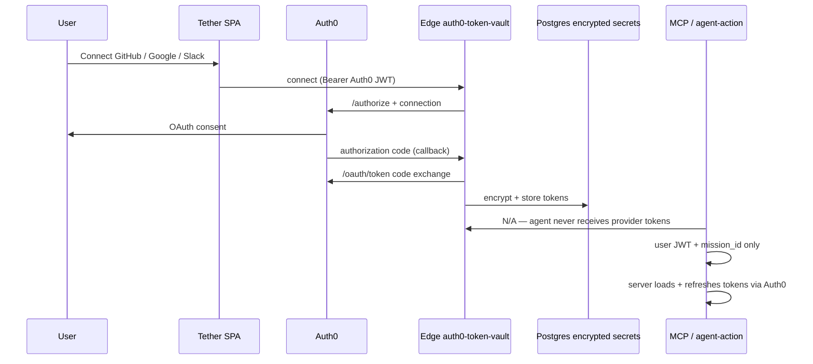

# Token Vault — evidence for judges (Authorized to Act)

This page is the **primary proof bundle** for the hackathon requirement to build with **[Auth0 Token Vault](https://auth0.com/features/token-vault)** / **Auth0 for AI Agents**. It ties the product definition to **this repository** and optional **screenshots** you place under [`judges-evidence/`](./judges-evidence/).

## How Auth0 defines Token Vault (what we map to)

Per [Auth0’s Token Vault FAQ](https://auth0.com/features/token-vault), Token Vault **manages third-party OAuth tokens** for agents: consent via standard OAuth, **storage and lifecycle** of access/refresh tokens, and **keeping raw credentials out of the agent and client**. Tether implements that separation of concerns: **Auth0 runs the OAuth flows to GitHub, Google, and Slack**; **only the Tether backend** decrypts material to call provider APIs after mission and policy checks.

## Proof in this codebase (verifiable without our dashboard)

| Claim | Where to look |
|--------|----------------|
| OAuth to providers goes through **Auth0** (`/authorize`, `/oauth/token`), not a custom IdP | [`supabase/functions/auth0-token-vault/index.ts`](../supabase/functions/auth0-token-vault/index.ts) — `connect` / `reauth` build `https://<domain>/authorize`; `callback` exchanges `authorization_code` at `https://<domain>/oauth/token`. |
| **Refresh** and rotation go through **Auth0’s token endpoint** | [`supabase/functions/_shared/oauth-token.ts`](../supabase/functions/_shared/oauth-token.ts) — `grant_type: "refresh_token"` against `https://<domain>/oauth/token`. |
| **Provider tokens are not exposed to the agent** | Agents call [`agent-action`](../supabase/functions/agent-action/index.ts) / [`mcp-server`](../supabase/functions/mcp-server/index.ts) with the user’s **Auth0 JWT** + mission context; provider secrets are loaded server-side from encrypted storage. |
| **Vaulted storage** (encrypted at rest, app-side) | [`connected_account_secrets` migration](../supabase/migrations/20260328180500_connected_account_secrets.sql) (written from `auth0-token-vault` callback) + [`encryptSecret`](../supabase/functions/_shared/crypto.ts) / [`decryptSecret`](../supabase/functions/_shared/crypto.ts). |
| **User control + consent** | Re-auth uses `prompt=consent` for step-up style reconfirmation in the same Edge function (`action === "reauth"`). |

### End-to-end flow (Auth0 ↔ Tether)

## Optional screenshots (drop files into `docs/judges-evidence/`)

Add PNG or WebP files with the names below so this doc and the folder README stay predictable for reviewers.

| File | What it should show |
|------|---------------------|
| `01-auth0-application-settings.png` | Auth0 **Application** used by Tether: Allowed Callback URLs includes `https://<project>.supabase.co/functions/v1/auth0-token-vault?action=callback`. |
| `02-auth0-social-connections.png` | **Authentication → Social** (or equivalent): GitHub, Google, Slack connections enabled for the tenant used in the demo. |
| `03-supabase-function-deployed.png` | Supabase **Edge Functions** list including `auth0-token-vault`, `agent-action`, `mcp-server`. |
| `04-app-connected-accounts.png` | Tether **Connected accounts** UI after a successful link (proves live OAuth through Auth0). |
| `05-network-authorize-to-auth0.png` | Browser DevTools **Network**: redirect to `https://<your-tenant>.auth0.com/authorize` when connecting a provider. |

If present, images render below:

## One-minute judge script

1. Open [`auth0-token-vault/index.ts`](../supabase/functions/auth0-token-vault/index.ts) and confirm Auth0 host + `/oauth/token` usage in `callback`.
2. Open [`oauth-token.ts`](../supabase/functions/_shared/oauth-token.ts) and confirm refresh via Auth0.
3. Open [`agent-action/index.ts`](../supabase/functions/agent-action/index.ts) and confirm provider calls occur **after** authz checks, not in the browser.
4. (Optional) Open the images in [`judges-evidence/`](./judges-evidence/) for tenant and live-app corroboration.

## Links

- Hackathon: [Authorized to Act on Devpost](https://authorizedtoact.devpost.com/)
- Auth0: [Token Vault feature](https://auth0.com/features/token-vault)
- Auth0 docs: [Token Vault intro](https://auth0.com/ai/docs/intro/token-vault) · [Call APIs on the user’s behalf](https://auth0.com/ai/docs/get-started/call-others-apis-on-users-behalf)
